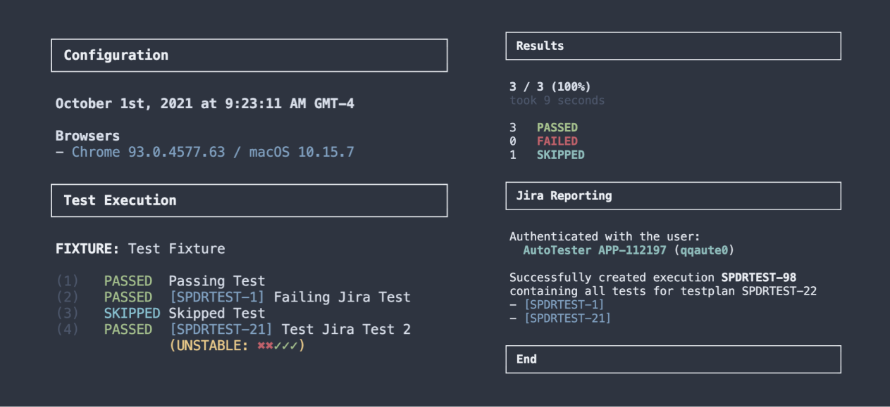

# testcafe-reporter-atc-spec



Reporter plugin for TestCafe which creates jira XRAY execution issues for tests labeled with a test issue key. The output of the reporter is also formatted to show all of the data, so the spec reporter is no longer nessisary. This package was made to work with the BMW ATC Jira server, however it can be used elsewhere, as long as the server has the XRAY plugin.


## Install

Install the package using the following command...

```
npm install testcafe-reporter-atc-spec
```

## Usage

### 1. Register Reporter

First you need to register the reporter with the framework using either the `.testcaferc.json` file...

```diff
{
  ...
  reporter: [
+   {
+     name: 'atc-spec',
+   },
  ]
}
```

or by passing it into the `reporter` method using the API

```diff
testCafe
    .createRunner()
    .src('path/to/test/file.js')
    .browsers('chrome')
+   .reporter('atc-spec')
    .run();
```

### 2. Set Credentials

Then the credentials to be used for the Jira requests need to be set. You can do this in the environment or by creating a `.env` file. To disable reporting to jira you can unset either of these values.

```bash
JIRA_USERNAME="username"
JIRA_PASSWORD="password"
```

You are also able to set the environment variable, `JIRA_URL`, in the case that you want to use a different jira server. Below is the default BMW ATC jira server.

```bash
JIRA_URL="https://atc.bmwgroup.net/jira"
```

### 3. Testcase Issue Keys

Lastly, each test case needs to be tied to the corresponding test issue that it is fulfilling. This is done by providing both of the following values via the meta method on each test. The test plan value is optional, however if it is not provided the tests results will not show up on any testplan (even if its part of one).

```typescript
test.meta({
  jiraTestKey: 'SPDRTEST-123',
  jiraTestPlanKey: 'SPDRTEST-321',
})('Example Test', async (t) => {
  ...
})
```

If you are using typescript, you can write out the following helper to insure that you provide the correct values (for linting/compilation)...

```typescript
export interface JiraMetadata {
  jiraTestKey: string
  jiraTestPlanKey?: string
}

export const jiraTest = (meta: JiraMetadata) => test.meta(meta)
```

Which can then be used in a test like so...

```typescript
jiraTest({
  jiraTestKey: 'SPDRTEST-123',
  jiraTestPlanKey: 'SPDRTEST-321',
})('Example Test', async (t) => {
  ...
})
```


## Dev

To improve this project, link your local copy of the repo with your project. Then start the dev process with `npm run dev`. Below are the steps, detailed.

```
  1. npm link (inside the lib/ folder of the plugin)
  2. npm link testcafe-reporter-atc-spec (inside root folder of the test repo)
  3. npm run dev (within the plugin project)
```
